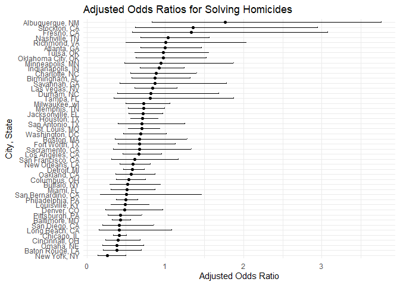
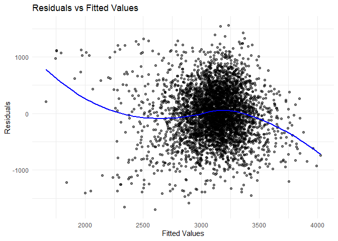

hw6
================
2024-12-01

### Problem 1

``` r
weather_df = 
  rnoaa::meteo_pull_monitors(
    c("USW00094728"),
    var = c("PRCP", "TMIN", "TMAX"), 
    date_min = "2017-01-01",
    date_max = "2017-12-31") %>%
  mutate(
    name = recode(id, USW00094728 = "CentralPark_NY"),
    tmin = tmin / 10,
    tmax = tmax / 10) %>%
  select(name, id, everything())
```

    ## using cached file: C:\Users\haoyi\AppData\Local/R/cache/R/rnoaa/noaa_ghcnd/USW00094728.dly

    ## date created (size, mb): 2024-12-01 20:33:05.598631 (8.685)

    ## file min/max dates: 1869-01-01 / 2024-11-30

``` r
bootstrap_weather <- function(data, n_bootstrap = 5000) {
  boot_results <- replicate(n_bootstrap, {
    sample_data <- data %>% sample_frac(size = 1, replace = TRUE)
    fit <- lm(tmax ~ tmin, data = sample_data)
    
    r_squared <- broom::glance(fit)$r.squared
    coefficients <- broom::tidy(fit)$estimate
    log_beta_product <- log(coefficients[1] * coefficients[2])
    
    c(r_squared = r_squared, log_beta_product = log_beta_product)
  }, simplify = TRUE)
  
  boot_results_df <- as.data.frame(t(boot_results))
  names(boot_results_df) <- c("r_squared", "log_beta_product")
  
  return(boot_results_df)
}

bootstrap_results <- bootstrap_weather(weather_df)

ci_r_squared <- quantile(bootstrap_results$r_squared, c(0.025, 0.975))
ci_product <- quantile(bootstrap_results$log_beta_product, c(0.025, 0.975))

ci_r_squared
```

    ##      2.5%     97.5% 
    ## 0.8943154 0.9273784

``` r
ci_product
```

    ##     2.5%    97.5% 
    ## 1.964517 2.059172

``` r
ggplot(bootstrap_results, aes(x = r_squared)) +
  geom_density() +
  labs(title = "Distribution of R-squared", x = "R-squared", y = "Frequency")
```

<!-- -->

``` r
ggplot(bootstrap_results, aes(x = log_beta_product)) +
  geom_density() +
  labs(title = "Distribution of log(β^0 * β^1)", x = "log(β^0 * β^1)", y = "Frequency")
```

<!-- -->

------------------------------------------------------------------------

### Problem 2

``` r
#load the data
homicides <- read_csv("./data/homicide-data.csv")
```

    ## Rows: 52179 Columns: 12
    ## ── Column specification ────────────────────────────────────────────────────────
    ## Delimiter: ","
    ## chr (9): uid, victim_last, victim_first, victim_race, victim_age, victim_sex...
    ## dbl (3): reported_date, lat, lon
    ## 
    ## ℹ Use `spec()` to retrieve the full column specification for this data.
    ## ℹ Specify the column types or set `show_col_types = FALSE` to quiet this message.

``` r
homicides <- homicides %>%
  mutate(
    city_state = str_c(city, ", ", state),
    solved_binary = if_else(disposition == "Closed by arrest", 1, 0),
    victim_age = as.numeric(victim_age)
  ) %>%
  filter(
    !city_state %in% c("Dallas, TX", "Phoenix, AZ", "Kansas City, MO", "Tulsa, AL"),
    victim_race %in% c("White", "Black"),
    !is.na(victim_age)
  )
```

    ## Warning: There was 1 warning in `mutate()`.
    ## ℹ In argument: `victim_age = as.numeric(victim_age)`.
    ## Caused by warning:
    ## ! 强制改变过程中产生了NA

``` r
head(homicides)
```

    ## # A tibble: 6 × 14
    ##   uid   reported_date victim_last victim_first victim_race victim_age victim_sex
    ##   <chr>         <dbl> <chr>       <chr>        <chr>            <dbl> <chr>     
    ## 1 Alb-…      20100601 SATTERFIELD VIVIANA      White               15 Female    
    ## 2 Alb-…      20100102 MULA        VIVIAN       White               72 Female    
    ## 3 Alb-…      20100126 BOOK        GERALDINE    White               91 Female    
    ## 4 Alb-…      20100130 MARTIN-LEY… GUSTAVO      White               56 Male      
    ## 5 Alb-…      20100308 GRAY        STEFANIA     White               43 Female    
    ## 6 Alb-…      20100323 DAVID       LARRY        White               52 Male      
    ## # ℹ 7 more variables: city <chr>, state <chr>, lat <dbl>, lon <dbl>,
    ## #   disposition <chr>, city_state <chr>, solved_binary <dbl>

``` r
#only baltimore data
baltimore <- homicides %>% 
  filter(city_state == "Baltimore, MD")

#ffit logistic regression model
baltimore_glm <- glm(
  solved_binary ~ victim_age + victim_sex + victim_race,
  family = binomial(),
  data = baltimore
)

#obtain odds ratio for male victims
baltimore_or <- broom::tidy(baltimore_glm) %>%
  filter(term == "victim_sexMale") %>%
  mutate(
    or = exp(estimate),
    ci_lower = exp(estimate - 1.96 * std.error),
    ci_upper = exp(estimate + 1.96 * std.error)
  )
baltimore_or 
```

    ## # A tibble: 1 × 8
    ##   term           estimate std.error statistic  p.value    or ci_lower ci_upper
    ##   <chr>             <dbl>     <dbl>     <dbl>    <dbl> <dbl>    <dbl>    <dbl>
    ## 1 victim_sexMale   -0.854     0.138     -6.18 6.26e-10 0.426    0.325    0.558

``` r
#logistic regression for all cities
cities <- homicides %>%
  group_by(city_state) %>%
  nest() %>%
  mutate(
    model = map(data, ~ glm(
      solved_binary ~ victim_age + victim_sex + victim_race,
      family = binomial(),
      data = .
    )),
    tidy_model = purrr::map(model, broom::tidy)
  ) %>%
  unnest(tidy_model) %>%
  filter(term == "victim_sexMale") %>%
  mutate(
    or = exp(estimate),
    ci_lower = exp(estimate - 1.96 * std.error),
    ci_upper = exp(estimate + 1.96 * std.error)
  ) %>%
  select(city_state, or, ci_lower, ci_upper)

cities %>%
  slice(1:5) %>%
  knitr::kable(digits = 3)
```

| city_state         |    or | ci_lower | ci_upper |
|:-------------------|------:|---------:|---------:|
| Albuquerque, NM    | 1.767 |    0.831 |    3.761 |
| Atlanta, GA        | 1.000 |    0.684 |    1.463 |
| Baltimore, MD      | 0.426 |    0.325 |    0.558 |
| Baton Rouge, LA    | 0.381 |    0.209 |    0.695 |
| Birmingham, AL     | 0.870 |    0.574 |    1.318 |
| Boston, MA         | 0.674 |    0.356 |    1.276 |
| Buffalo, NY        | 0.521 |    0.290 |    0.935 |
| Charlotte, NC      | 0.884 |    0.557 |    1.403 |
| Chicago, IL        | 0.410 |    0.336 |    0.501 |
| Cincinnati, OH     | 0.400 |    0.236 |    0.677 |
| Columbus, OH       | 0.532 |    0.378 |    0.750 |
| Denver, CO         | 0.479 |    0.236 |    0.971 |
| Detroit, MI        | 0.582 |    0.462 |    0.734 |
| Durham, NC         | 0.812 |    0.392 |    1.683 |
| Fort Worth, TX     | 0.669 |    0.397 |    1.127 |
| Fresno, CA         | 1.335 |    0.580 |    3.071 |
| Houston, TX        | 0.711 |    0.558 |    0.907 |
| Indianapolis, IN   | 0.919 |    0.679 |    1.242 |
| Jacksonville, FL   | 0.720 |    0.537 |    0.966 |
| Las Vegas, NV      | 0.837 |    0.608 |    1.154 |
| Long Beach, CA     | 0.410 |    0.156 |    1.082 |
| Los Angeles, CA    | 0.662 |    0.458 |    0.956 |
| Louisville, KY     | 0.491 |    0.305 |    0.790 |
| Memphis, TN        | 0.723 |    0.529 |    0.988 |
| Miami, FL          | 0.515 |    0.304 |    0.872 |
| Milwaukee, wI      | 0.727 |    0.499 |    1.060 |
| Minneapolis, MN    | 0.947 |    0.478 |    1.875 |
| Nashville, TN      | 1.034 |    0.685 |    1.562 |
| New Orleans, LA    | 0.585 |    0.422 |    0.811 |
| New York, NY       | 0.262 |    0.138 |    0.499 |
| Oakland, CA        | 0.563 |    0.365 |    0.868 |
| Oklahoma City, OK  | 0.974 |    0.624 |    1.520 |
| Omaha, NE          | 0.382 |    0.203 |    0.721 |
| Philadelphia, PA   | 0.496 |    0.378 |    0.652 |
| Pittsburgh, PA     | 0.431 |    0.265 |    0.700 |
| Richmond, VA       | 1.006 |    0.498 |    2.033 |
| Sacramento, CA     | 0.669 |    0.335 |    1.337 |
| San Antonio, TX    | 0.705 |    0.398 |    1.249 |
| San Bernardino, CA | 0.500 |    0.171 |    1.462 |
| San Diego, CA      | 0.413 |    0.200 |    0.855 |
| San Francisco, CA  | 0.608 |    0.317 |    1.165 |
| Savannah, GA       | 0.867 |    0.422 |    1.780 |
| St. Louis, MO      | 0.703 |    0.530 |    0.932 |
| Stockton, CA       | 1.352 |    0.621 |    2.942 |
| Tampa, FL          | 0.808 |    0.348 |    1.876 |
| Tulsa, OK          | 0.976 |    0.614 |    1.552 |
| Washington, DC     | 0.690 |    0.468 |    1.017 |

``` r
#plot
cities %>%
  ggplot(aes(x = fct_reorder(city_state, or), y = or)) +
  geom_point() +
  geom_errorbar(aes(ymin = ci_lower, ymax = ci_upper), width = 0.2) +
  coord_flip() +
  labs(
    title = "Adjusted Odds Ratios for Solving Homicides",
    x = "City, State",
    y = "Adjusted Odds Ratio"
  ) +
  theme_minimal()
```

<!-- -->
Most cities smaller than OR of 1, indicating that after controlling for
victim age and race, the likelihood of a crime involving a male victim
being resolved is lower than that of a crime involving a female victim.

------------------------------------------------------------------------

### Problem 3

``` r
birthweight <- read_csv("./data/birthweight.csv")
```

    ## Rows: 4342 Columns: 20
    ## ── Column specification ────────────────────────────────────────────────────────
    ## Delimiter: ","
    ## dbl (20): babysex, bhead, blength, bwt, delwt, fincome, frace, gaweeks, malf...
    ## 
    ## ℹ Use `spec()` to retrieve the full column specification for this data.
    ## ℹ Specify the column types or set `show_col_types = FALSE` to quiet this message.

``` r
birthweight <- birthweight %>%
  janitor::clean_names() %>%
  mutate(
    babysex = factor(babysex, levels = c(1,2), labels = c("male", "female")),
    malform = case_when(malform == 0 ~ "absent", malform == 1 ~ "present"),
    mrace = factor(mrace, levels = c(1,2,3,4,8), labels = c("White", "Black", "Asian", "Puerto Rican", "Other")),
    frace = factor(frace, levels = c(1,2,3,4,8,9), labels = c("White", "Black", "Asian", "Puerto Rican", "Other", "Unknow"))) %>%
  drop_na() 
```

``` r
#average birthweight by baby's sex
birthweight %>%
  group_by(babysex) %>%
  summarise(
    avg_birthweight = mean(bwt, na.rm = TRUE),
    count = n()
  )
```

    ## # A tibble: 2 × 3
    ##   babysex avg_birthweight count
    ##   <fct>             <dbl> <int>
    ## 1 male              3158.  2230
    ## 2 female            3069.  2112

My model trying to capture the most critical factors influencing
birthweight while avoiding overfitting and ensuring interpretability. To
achieve this goal I believe following predictors are important,
Gestational Age, Maternal Weight Gain, Baby’s Sex, and Malformations.
The reason are following: Gestational age is universally recognized as a
primary determinant of birthweight. Maternal Weight Gain is the weight a
mother gains during pregnancy, which I beleive is directly linked to the
baby’s growth and weight. Baby’s Sex: Male babies tend to have slightly
higher birthweights on average compared to female babies, this being
verified by the code above. Male has 3157.583 avg birthweight while
female has 3068.812 avg birthweight. Malformations: Congenital
malformations may adversely affect fetal growth, leading to lower
birthweights.

``` r
#fit the proposed regression model
mymodel <- lm(bwt ~ gaweeks + wtgain + babysex + malform, data = birthweight)


#add some predictions and residuals
birthweight <- birthweight %>%
  modelr::add_predictions(mymodel, var = "fitted") %>%
  modelr::add_residuals(mymodel, var = "residuals")
```

``` r
#plot
birthweight %>%
  ggplot(aes(x = fitted, y = residuals)) +
  geom_point(alpha = 0.5) +
  geom_smooth(method = "loess", color = "blue", se = FALSE) +
  labs(
    title = "Residuals vs Fitted Values",
    x = "Fitted Values",
    y = "Residuals"
  ) +
  theme_minimal()
```

    ## `geom_smooth()` using formula = 'y ~ x'

<!-- -->

``` r
#crossvalidation
cv_data <- birthweight %>%
  crossv_mc(100) %>%
  mutate(
    train = map(train, as_tibble),
    test = map(test, as_tibble)
  )
```

``` r
cv_results <- cv_data %>%
  mutate(
    mymodel = map(train, ~ lm(bwt ~ gaweeks + wtgain + babysex + malform, data = .)),
    model1 = map(train, ~ lm(bwt ~ blength + gaweeks, data = .)),
    model2 = map(train, ~ lm(bwt ~ bhead * blength * babysex, data = .)),
    rmsemy = map2_dbl(mymodel, test, ~ rmse(model = .x, data = .y)),
    rmse1 = map2_dbl(model1, test, ~ rmse(model = .x, data = .y)),
    rmse2 = map2_dbl(model2, test, ~ rmse(model = .x, data = .y))
  )
```

``` r
#summarize the data
cv_summary <- cv_results %>%
  summarise(
    mean_rmsemy = mean(rmsemy),
    mean_rmse1 = mean(rmse1),
    mean_rmse2 = mean(rmse2)
  )
```

``` r
cv_results %>%
  select(starts_with("rmse")) %>%
  pivot_longer(
    cols = everything(),
    names_to = "model",
    values_to = "rmse",
    names_prefix = "rmse_"
  ) %>%
  ggplot(aes(x = model, y = rmse)) +
  geom_violin(fill = "lightblue") +
  labs(
    title = "RMSE Comparison of Models",
    x = "Models",
    y = "RMSE"
  ) 
```

<!-- -->
Based on the plot, rmse2 (the one with interaction) is the most accurate
because it has the lowest median RMSE compared to rmse1 (the one using
length at birth and gestational age) and rmsemy. Additionally, while
rmse2 shows moderate variability in RMSE its values are consistently
lower than those of rmsemy, which has the highest RMSE and a wider
spread, suggesting less stable performance. There is a narrower
distribution for rmse1, however, with higher RMSE it is not very
persuasive.
